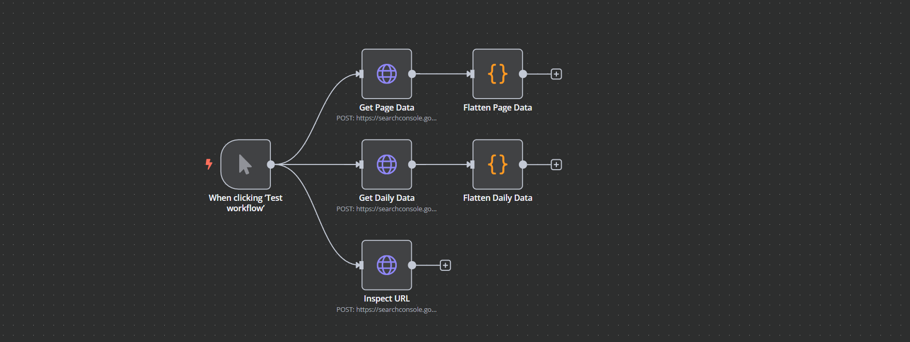

# Get Google Search Console Data

This **n8n template** uses HTTP nodes and the **Google Search Console API** to fetch the following data for a specific page:

- Overall clicks, impressions, CTR, and position
- Daily performance
- URL inspection data like canonical url, indexed status, last date crawled

## Tutorial

If you have never worked with the Google Search Console API, then I would recommend to watch my tutorial on YouTube. You will learn how to create the credential, where to find the client_id, client_secret as well as the right scopes and more. You can find the tutorial [here](https://youtu.be/UPG87Wxzaf8).

## Why Is This Template Useful?

If you've used my other templates, you may have noticed that I primarily use **BigQuery** for analyzing the performance of my websites. However, there are some disadvantages:

- Not everyone has activated their bulk export.
- Even if they have, they often miss historical data, which is crucial for detailed analysis.

This template solves these issues by directly fetching performance data and inspection details from the Google Search Console API.

## What Does This Template Do?

This workflow:

1. Fetches the **performance data** of any URL from your property.
2. Inspects the URL and provides important details, such as:
   - Last time crawled
   - Indexing status
   - Canonical URL
   - And more

Additionally, there are two nodes for **parsing the data**, making it easy to integrate this connection into other templates, such as the  [Keyword Rank Tracker](../keyword-rank-tracker/readme.md) or [AI SEO Writer](../gsc-ai-seo-writer/readme.md).

## Benefits

- **Free tier**: The Google Search Console API offers a free tier.
- **No need for additional SEO tools**: Get accurate data directly from Google for your page.
- **Customizable**: The template already includes the request body for the required API calls.
